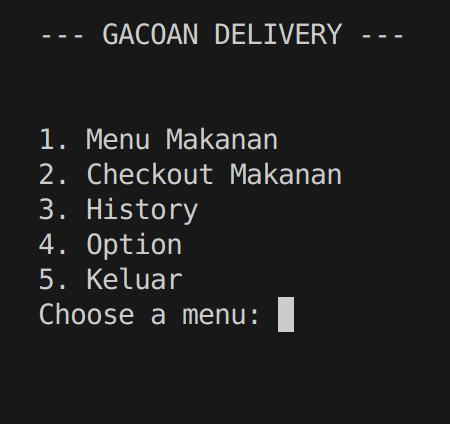
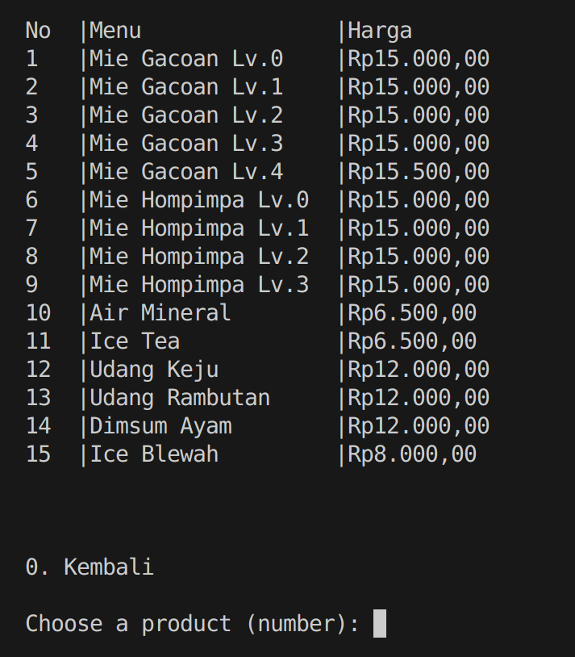
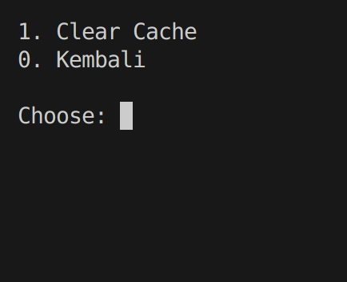
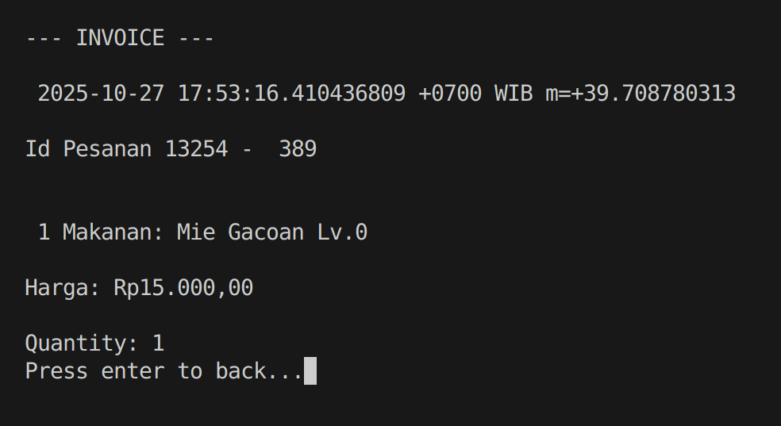
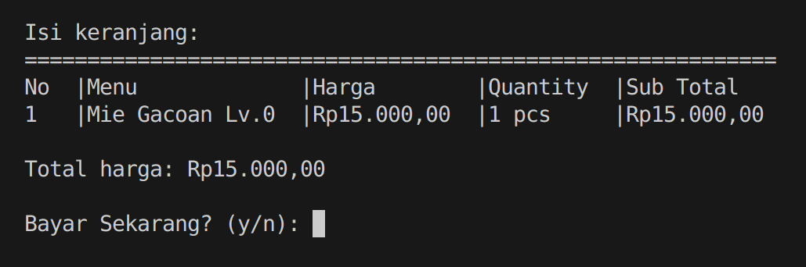
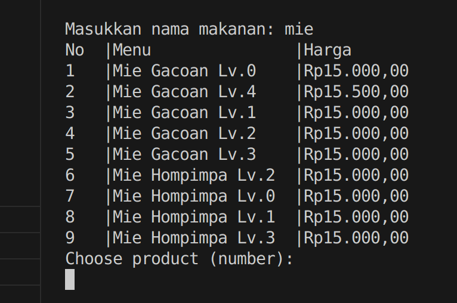

# Gacoan APP

Aplikasi sederhana pemesanan makanan yang berjalan di terminal / CLI, project ini memuat fitur pesan makanan, keranjang, history dan menu option untuk menghapus data dari temp, aplikasi ini didesain semirip mungkin dengan aplikasi nyata yang sudah ada namun dijalan di atas terminal / CLI

## 📸 Preview

<div align="center">
  
  

</div>

<div align="center">
  
  
</div>

<div>
  
   
</div>

## 🛠️ Tech Stack

**Go (Golang)**
— bahasa pemrograman utama untuk membangun aplikasi

**godotenv**
— untuk membaca dan memuat file .env

**text/tabwriter**
— untuk menampilkan output tabel di terminal

**paimanbandi/rupiah**
— konversi angka ke format mata uang Rupiah

**Standard Library Go:**

fmt, os, time, bufio, net/http, encoding/json, dll.

**Git** — untuk version control dan kolaborasi

## 🚀 How to Run

1. Clone repository ini

```bash
   git clone https://github.com/abdullah-fikri/koda-b4-golang-weekly.git
```

2. Masuk ke directory project

```bash
   cd koda-b4-golang-weekly
```

3. Jalankan aplikasi

```bash
   go run main.go
```

## 🤝 How to Contribute

Kontribusi selalu diterima! Berikut cara untuk berkontribusi:

1. Fork repository ini
2. Buat branch baru untuk fitur Anda (`git checkout -b feature/AmazingFeature`)
3. Commit perubahan Anda (`git commit -m 'Add some AmazingFeature'`)
4. Push ke branch (`git push origin feature/AmazingFeature`)
5. Buat Pull Request

### Aturan Kontribusi

- Pastikan code Anda mengikuti style guide yang ada
- Tulis commit message yang jelas dan deskriptif
- Update dokumentasi jika diperlukan
- Tambahkan tests untuk fitur baru
